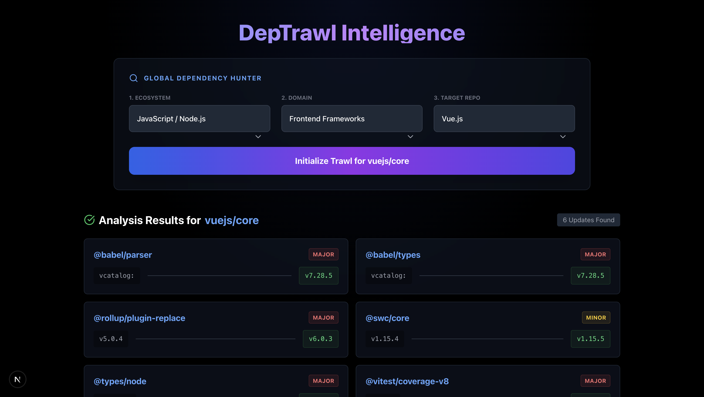

# 🕸️ DepTrawl Intelligence
### The Polyglot Dependency Scanner for Modern Engineering Teams.

[](https://nextjs.org/)
[](https://www.typescriptlang.org/)
[](https://tailwindcss.com/)
[](https://docs.github.com/en/rest)
[](LICENSE)

**DepTrawl** is an intelligent, open-source web application designed to identify outdated dependencies, security risks, and technical debt across multiple programming ecosystems.

Unlike simple version checkers, DepTrawl uses a **Smart Filter UI** to guide users through 50+ technology stacks and leverages a **Polyglot Backend** that intelligently detects and parses manifest files (`package.json`, `requirements.txt`, `go.mod`, `pom.xml`, etc.) without requiring a local clone.

---

## 🚀 Key Features

### 🌐 Polyglot Support
Support for **8 major ecosystems** and counting. If it's on GitHub, we can scan it.
* **JavaScript/TypeScript:** `npm`, `yarn`, `pnpm`
* **Python:** `requirements.txt`, `pyproject.toml` (Pandas/NumPy support)
* **Java:** Maven (`pom.xml`), Gradle (`build.gradle`)
* **Go:** `go.mod` (with version parsing)
* **Rust:** `Cargo.toml`
* **PHP:** `composer.json`
* **Ruby:** `Gemfile`

### 🧠 Intelligent Analysis
* **Manifest Detection:** Automatically finds the correct dependency file in a repo.
* **Registry Cross-Reference:** Checks live registries (npm, PyPI, Maven Central, Crates.io) for the absolute latest stable versions.
* **Severity Grading:** Automatically flags **Major** version jumps (e.g., v1.0 → v2.0) as high-priority updates versus minor patches.

### 🎨 Modern Experience
* **Smart Filter UI:** A cascading dropdown interface that prevents invalid combinations (e.g., you can't search for a React package in a Python project).
* **Real-time Progress:** Visual feedback during deep scans.
* **Serverless Architecture:** Built on Next.js API Routes for instant, scalable analysis.

---

## 🛠️ Tech Stack

* **Framework:** Next.js 14 (App Router)
* **Language:** TypeScript (Strict Mode)
* **Styling:** Tailwind CSS + Lucide React (Icons)
* **Backend Logic:** Octokit (GitHub SDK) + Axios
* **Animation:** Framer Motion

---

## ⚡ Getting Started

Follow these steps to set up DepTrawl locally.

### Prerequisites
* Node.js 18+ installed.
* A GitHub Account (for API Token).

### 1. Clone the Repository
```bash
git clone [https://github.com/SimonTingle/dependency_scanner.git](https://github.com/SimonTingle/dependency_scanner.git)
cd dependency_scanner
````

### 2\. Install Dependencies

```bash
npm install
```

### 3\. Configure Environment Variables

Create a `.env.local` file in the root directory to prevent API rate limiting.

```bash
touch .env.local
```

Open `.env.local` and add your GitHub Personal Access Token:

```env
# Generate token at: [https://github.com/settings/tokens](https://github.com/settings/tokens)
# Scope needed: public_repo (for reading public repositories)
GITHUB_TOKEN=ghp_your_token_here_123456
```

### 4\. Run the Development Server

```bash
npm run dev
```

Open [http://localhost:3000](https://www.google.com/search?q=http://localhost:3000) to start trawling\!

-----

## 📖 Usage Guide

1.  **Select Ecosystem:** Choose the broad technology (e.g., "Web Frontend", "AI & Data").
2.  **Select Domain:** Narrow down the scope (e.g., "React Ecosystem", "Machine Learning").
3.  **Select Target:** Pick from the curated list of popular repositories, or type a custom `owner/repo` string.
4.  **Scan:** Click **Initialize Trawl**. The app will fetch the manifest, parse it, check registries, and display a report of outdated packages.

-----

## 🤝 Contributing

Contributions make the open-source community an amazing place to learn, inspire, and create. Any contributions you make are **greatly appreciated**.

1.  Fork the Project
2.  Create your Feature Branch (`git checkout -b feature/AmazingFeature`)
3.  Commit your Changes (`git commit -m 'Add some AmazingFeature'`)
4.  Push to the Branch (`git push origin feature/AmazingFeature`)
5.  Open a Pull Request

-----

## 📸 Screenshots


